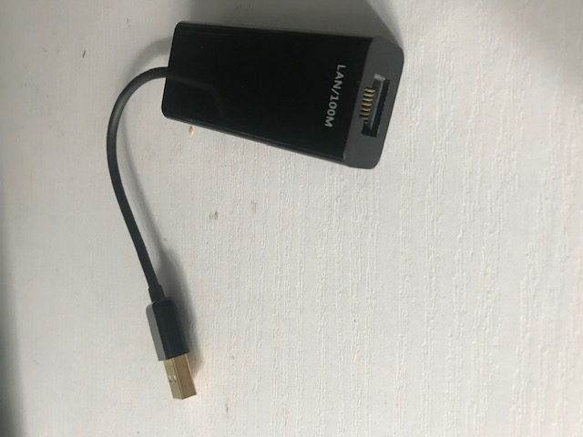

# USB to NIC 

  

### What it used for?
If you want to add more network interfaces to your device without assembling the inner hardware, however, there is only USB in your device. That is the scenario where you can use USB-NIC adapter.

### How to use it ?
Simply plug the USB interface to your device, e.g, computer, the network interface on the other end is added as part of the computer hardware, which you can plug Ethernet cable into.
