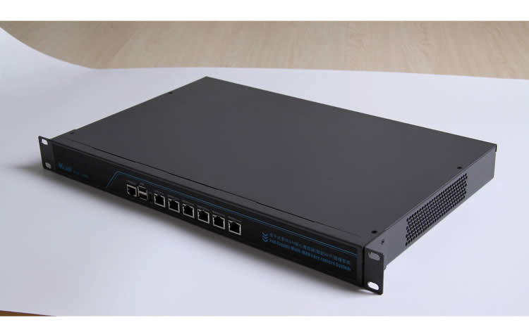
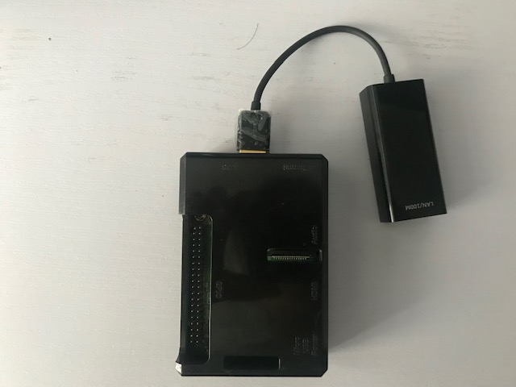

# Soft Router

### What is Soft Router

Router is a specified type of network device. As a customer, you could purchase routers from vendors, such as `Cisco`, `Huwai`, `TP-Link`. It consists of the hardware and software part, which have been designed and produced by those vendors. Once you buy the hardware, you get the whole routing features. However, if you want to perform centain modification, it depends on the API the software provides, you may not be able to do the adjustment you want in this scenario.

And here, so called `Soft Router` means that the device you purchase has hardware interfaces as a router, e.g, multiple `NIC`, Network Interface Card. However, you have to configure on your own to make this device a router.

### What it looks like
* We have bought this online. Its arch is `x86`.

  

* We use a Raspberry Pi 3 and a USB-NIC adapter to get two NICs, you can plug more to get more NICs. Its arch is `arm`.

  

### Configuration
* Install an operating system
* Configurate it as a router
* Make adjustment to fit your special needs

### Where to buy and how much does it cost
* Amazon
* Taobao
